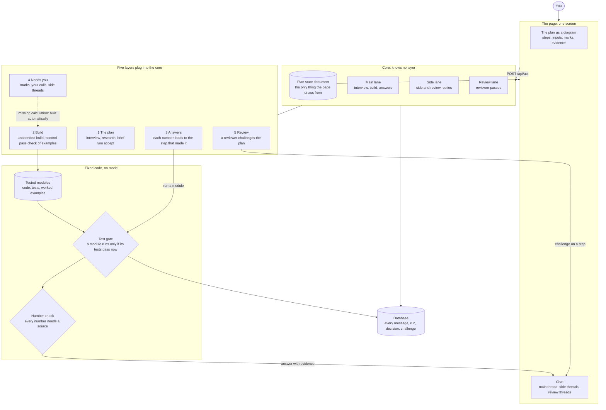

# Financial Advisor Harness

A small agent harness for personal finance, built one layer at a time. You describe a money goal and the harness draws the plan as a diagram, builds and tests the calculations, and answers your questions with every number traced to a step. It shows you what it assumed, asks only where the call is yours, and has a reviewer challenge the plan.

The running example is a plan to pay for a wedding on time (`examples/wedding/`). The harness itself knows nothing about weddings.

## Who this is for

The repository serves four uses. They are listed in order of how well a two-hour workshop fits them.

1. **Presenting.** Show the harness being built one layer at a time on the main example, and what each layer adds.
2. **Following along.** Run each layer on the main example as it is presented, change figures and choices, and see what changes. If you fall behind, you catch up.
3. **A variation of the main example.** Keep the same kind of plan (saving towards dated payments) with your own figures and dates. This follows along well.
4. **Your own plan, or your own harness, from scratch.** Possible, and the contract and tests are there for it, but building an entirely different harness or a very different plan from scratch will likely not fit a two-hour session. The plan must be a money question that arithmetic on amounts and dates can answer.

Whichever you choose, you leave with a working harness: the code in `harness/`, your own plan in `my/`, and nothing from the workshop mixed in. Everyone needs model access on their own machine.

## How it fits together



The model talks, asks and explains. Everything that produces or admits a number is fixed code: the tested modules, the test gate and the number check. The five layers are what the workshop adds, in order. There are no account files and no verifier in version 2.

## What is here

| Path | What it is |
| --- | --- |
| `SPEC.md`, `ARCHITECTURE.md` | The contract (behaviour, state document, actions) and how it is built |
| `design/` | The product design, the design system and the source of the page (`design/page/`) |
| `harness/` | The harness: the core, and one package per layer |
| `tests/` | Offline tests, one folder per layer (`tests/layer0` to `tests/layer5`) |
| `reference/` | Saved finance terms with checked sources, for offline lookups |
| `examples/` | Two seeded examples, `wedding` and `moving`: plan, built modules, scenarios. See `examples/README.md` |
| `my/` | Yours: `my/brief/` (your plan), `my/modules/` (your tested calculations) and `my/var/` (database and working files, never committed) |
| `workshop/` | The workshop guides, build prompts and the `workshop` command. Optional: the harness never uses it |

## Set up

Install [uv](https://docs.astral.sh/uv/), a small tool that fetches a suitable Python and keeps everything in a `.venv` folder in the repository. Deleting `.venv` undoes it.

```
curl -LsSf https://astral.sh/uv/install.sh | sh     # macOS or Linux (or: brew install uv)
```

On Windows: `powershell -ExecutionPolicy ByPass -c "irm https://astral.sh/uv/install.ps1 | iex"`

Then you need model access, one of:

- **Claude Code** installed and signed in with your Claude plan. Check with `claude auth status`. Usage counts against your plan. If `ANTHROPIC_API_KEY` is set in your shell, unset it, or it is used instead.
- **An Anthropic API key**: `export ANTHROPIC_API_KEY=...`, and run with `uv run --extra claude`.

`HARNESS_MODEL_PROVIDER` can force `claude_code`, `anthropic` or `scripted` (prepared replies, used by every test). The default `auto` picks `anthropic` when a key and the package are present, else `claude_code`. `HARNESS_MODEL` picks the model; the default is `claude-sonnet-5-5`.

```
uv run python -m harness check
```

It sends the model a one-line test and should end with `Setup works: the model replied and the check was saved as event 1.` A model reply takes 20 to 60 seconds through Claude Code.

## Use it

```
uv run python -m harness ui                             # your own plan
HARNESS_EXAMPLE=wedding uv run python -m harness ui     # the main example
```

The page opens in your browser, served from your machine. It has two parts that never change: the plan as a diagram, and the chat beside it. Click a step to attach it to your next message, or open its details. Add `--port N` or `--no-browser` if you need to.

1. **Describe a goal.** On an empty page, say what you want help with. The harness reads up on the finance terms you use, asks one question at a time, and draws a plan. Or open the main example, which starts with an accepted plan.
2. **Accept the plan.** Click a step and say what is wrong to correct it; the diagram redraws. A plan with open questions can still be accepted.
3. **Build.** One button builds every calculation step without stopping, which takes one to four minutes. Each step shows how many worked examples it has and how many tests pass. Examples are checked by a second model pass and are marked "checked by a second pass" until you confirm them.
4. **Ask.** Ask about your plan in the chat. Every number in an answer leads to the step that produced it. A number no tested step produced is held back.
5. **Marks and your calls.** An answer that rests on something you did not confirm carries a mark: confirm it or change it. A call that is yours to make stops and asks, with options as buttons or in your own words. A calculation the plan lacks is built for you and shows as "not in the plan".
6. **Side threads.** Use "On the side" to ask what a term means or why, without changing anything. To make something count, say it in the main chat.
7. **Review.** After the plan is accepted a reviewer looks for weak assumptions and challenges them, each as a thread on a step. Choose "use this" or "dismiss". It never blocks. The **Review** toggle shows the challenged steps.

Your work is kept in `my/` (or, with `HARNESS_EXAMPLE`, in a copy under `my/var/examples/<name>/`; delete that folder to start the example again). Do not type account numbers or passwords into the chat.

**In a terminal instead.** The same actions, as text:

```
uv run python -m harness ground          # the interview; /accept, /wrap, /quit
uv run python -m harness build           # build the calculation steps of the accepted plan
uv run python -m harness ask "..."       # ask; /confirm, /side TEXT, /reply TEXT, /quit
uv run python -m harness events          # everything recorded
```

Which commands exist depends on the layers on (below). `ground`, `build` and `ask` come with layers 1, 2 and 3.

**Lookups.** The harness checks `reference/terms.json` first and asks Wikipedia only for terms the file does not know. Only a short general term is sent, never your figures. Set `HARNESS_RESEARCHER=reference` to stay offline. The reviewer's outside lookups also need Wikipedia to be reachable.

## Check a change

Tests run offline with the scripted model: `uv run pytest -q` (a few hundred tests, about 40 seconds). They are in `tests/layer0` to `tests/layer5`, and the tests of layer K pass with layers above K off.

To see a change with the real model, replay a seeded scenario, a scripted person playing against it:

```
uv run python -m harness replay wedding                       # every scenario of the example
uv run python -m harness replay wedding cover_each_payment    # one; add --keep to keep the scratch copy
```

It prints a line per expectation and exits 0 only when all pass. A scenario takes 30 seconds to two minutes, a whole example 2 to 7 minutes. The model varies between runs, so run a failure twice before believing it. `examples/README.md` lists the scenarios.

## Moving through the steps

The workshop builds the harness in six steps, 0 (the core) and 1 to 5 (the layers). The `workshop` command moves your copy between them. It never touches `my/brief`, `my/modules` or your database, and it copies any file of yours it would replace to `my/var/set-aside/` first. `workshop/README.md` is the guide.

```
uv run python -m workshop status          # which layers are present and on
uv run python -m workshop at N            # run this copy as the harness at step N; removes nothing
uv run python -m workshop start N         # remove step N's code (and later layers), to build it yourself
uv run python -m workshop finish N        # restore the code of layers 1 to N from git
uv run python -m workshop leave           # remove workshop/ and keep the harness
uv run python -m workshop check           # the drift check, about five minutes
```

## The three places

- `harness/` is the product. Nothing under it names an example, and it never imports `workshop/`.
- `my/` is yours. The harness writes only there. Nothing we ship overwrites it.
- `workshop/` is teaching material and the `workshop` command. Delete it and the harness's tests still pass.

To add another model provider, add one file under `harness/model/` and one line in `harness/model/providers.py`.
