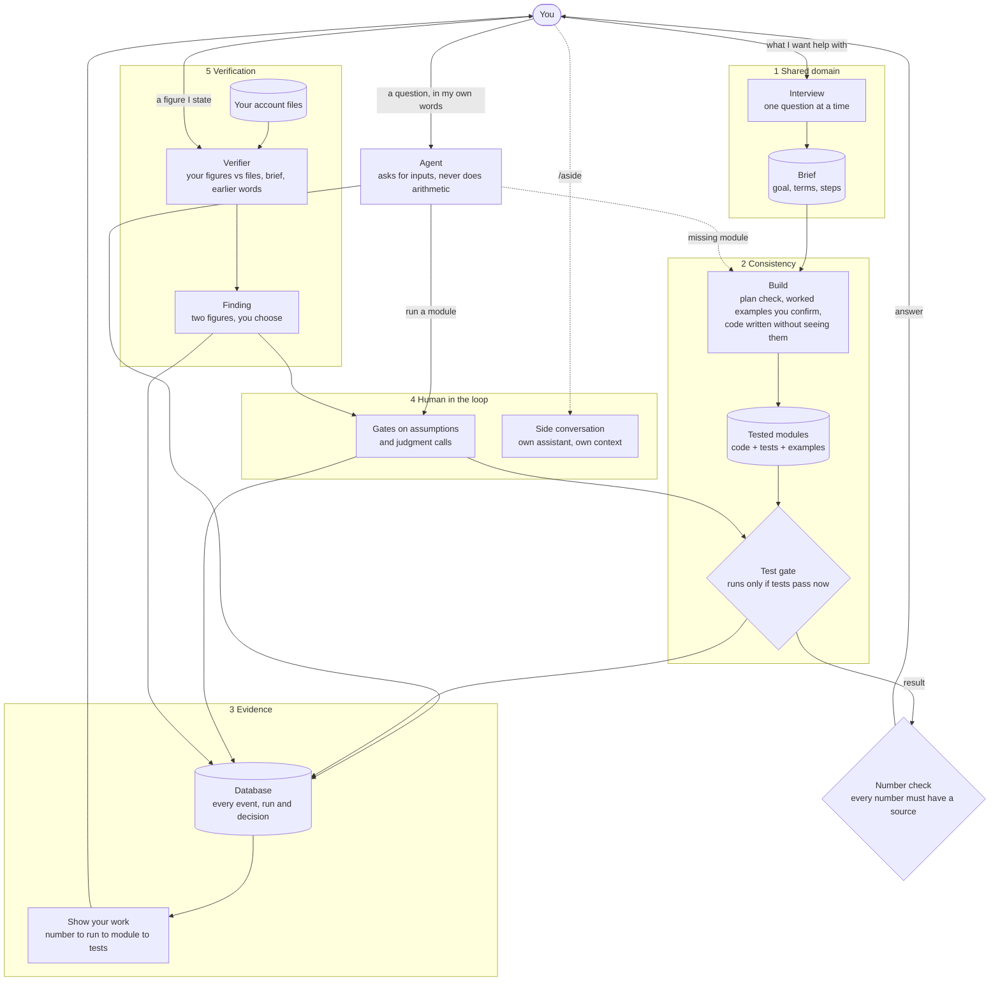

# Finance harness workshop

A small agent harness for personal finance work, built one design principle
at a time. The running example is an agent that helps one person stay on
top of their money so that their wedding is paid for without surprises.

The harness itself knows nothing about weddings. The example lives in
`examples/wedding/`.

## Who this is for

The repository serves four uses. They are listed in order of how well a
two-hour workshop fits them.

1. **Presenting.** Show the harness being built one principle at a time on the
   main example, and what each step adds: before, the model's word; after,
   something you can check.
2. **Following along.** Run each step on the main example as it is presented,
   change figures and choices, and see what changes. If you fall behind, you
   catch up to the current step.
3. **A variation of the main example.** Keep the same kind of plan (saving
   towards dated payments) with your own figures, dates and data. This follows
   along well.
4. **Your own plan, or your own harness, from scratch.** Possible, and the
   contract and tests are there for it, but it will likely not fit in the
   session. The interview and build alone take about twenty minutes of model
   time. The plan must be a money question that arithmetic on amounts and
   dates can answer.

Whichever you choose, you leave with a working harness: the code in
`harness/`, your own plan in `my/`, and nothing from the workshop mixed in.
Everyone needs model access on their own machine (Claude Code signed in, or
an Anthropic API key).

## How it fits together



The model talks, asks and explains. Everything that produces or admits a
number is fixed code: the modules, the test gate, the number check, the
account-file reader. The numbered boxes are the five principles, in the order
the workshop adds them.

## What is here

| Path | What it is |
| --- | --- |
| `SPEC.md` | The contract every build step follows |
| `harness/` | The harness |
| `tests/` | Acceptance tests per step, plus tests for the account-file fixture in `tests/fixtures/accounts/` (older example data, its generator and key, which the source adapter's tests read) |
| `reference/` | Saved finance terms with checked sources, for offline lookups |
| `examples/` | Two complete seeded examples, `wedding` and `moving`: brief, modules, scenarios and, for the wedding, account files |
| `my/` | Yours: `my/brief/` (the domain brief, once you have run the interview), `my/modules/` (the tested calculation modules, once you have run the build) and `my/var/` (the database and other working files, never committed) |
| `workshop/` | The workshop: `README.md` (the guide for attendees), `FACILITATOR.md`, `BUILD_PLAN.md`, `prompts/` (one build prompt per step, for any coding agent), and the `workshop` command. Optional: the harness never uses it |

## Moving through the steps

The workshop builds the harness in six steps, 0 to 5.
This command moves your copy between them. It never touches `my/brief`,
`my/modules` or your database, and it copies any file of yours it would
replace to `my/var/set-aside/` first.

```
uv run python -m workshop status      # where this copy stands
uv run python -m workshop start N     # the start of step N: its contract, tests and prompt
uv run python -m workshop next        # install the next step's tests; your own code stays
uv run python -m workshop finish N    # the end of step N, to catch up or skip ahead
uv run python -m workshop leave       # remove workshop/ and keep the harness
```

`workshop/README.md` is the guide for attendees.

## Set up

The simplest way is [uv](https://docs.astral.sh/uv/). It is one small tool
that fetches a suitable Python if your machine has none, and keeps
everything this project needs in a `.venv` folder inside the repository.
Nothing else on your machine changes, and deleting `.venv` undoes it.

```
curl -LsSf https://astral.sh/uv/install.sh | sh     # macOS or Linux (or: brew install uv)
```

On Windows: `powershell -ExecutionPolicy ByPass -c "irm https://astral.sh/uv/install.ps1 | iex"`

Then, from the repository root:

```
uv run pytest -q                                           # sets everything up, then runs the tests
HARNESS_MODEL_PROVIDER=scripted uv run python -m harness check
uv run python -m harness events
```

Put `uv run` in front of any command in this repository and it runs inside
that environment.

Without uv, any Python 3.11 or later works:

```
python3 -m venv .venv && source .venv/bin/activate
pip install pytest
python -m pytest -q
```

## Choose how the harness reaches a model

The harness talks to a model through one interface. `HARNESS_MODEL_PROVIDER`
picks what sits behind it. If you set nothing, the default is `auto`, which
uses the `anthropic` provider when `ANTHROPIC_API_KEY` is set and the
`anthropic` package is installed, and otherwise `claude_code` when the
`claude` command is on your path. If neither is there, it stops and tells
you what to install.

| Provider | What you need | Notes |
| --- | --- | --- |
| `auto` | Either of the two below | The default. Picks one as described above. |
| `scripted` | Nothing | Replays prepared responses. Used by every test. |
| `claude_code` | [Claude Code](https://code.claude.com/docs/en/overview) installed and signed in with your Claude plan | No API key. Usage counts against your plan. |
| `anthropic` | A Claude API key | Billed to the key. Needs the `claude` extra (see below). |

With a Claude subscription and no API key:

```
claude auth status                        # should say you are logged in
uv run python -m harness check
```

Nothing needs exporting: `auto` finds Claude Code. The check prints which
provider it used. To choose it yourself, add
`export HARNESS_MODEL_PROVIDER=claude_code`.

The check sends the model a one-line test and should end with
`Setup works: the model replied and the check was saved as event 1.`

If `ANTHROPIC_API_KEY` is set in your shell, Claude Code uses that key
instead of your plan, and `auto` prefers the `anthropic` provider when the
package is installed, so unset the key first. If the check reports an unknown
option, update Claude Code with `claude update`.

With an API key:

```
export ANTHROPIC_API_KEY=...
export HARNESS_MODEL_PROVIDER=anthropic     # optional: auto would pick it too
uv run --extra claude python -m harness check
```

If you choose `anthropic` without the package, the harness says so and
shows the install command (`uv sync --extra claude`).

`HARNESS_MODEL` picks the model. The default is `claude-sonnet-5-5`; with
`claude_code` you can also use an alias such as `sonnet` or `haiku`.

## Run the grounding interview

Step 1 is a short interview. The harness asks what you want help with, checks
the finance terms you use against their standard meaning, and writes a
**domain brief**: your goal, the terms you agreed, what is particular to you,
and the steps needed, with the ones that must run as code marked.

```
uv run python -m harness ui
```

This opens a page in your browser, served from your own machine. The
conversation is on the left. On the right, the shared understanding builds
up as you talk:

- **Reading**: what the harness is reading up on, and where each answer came from.
- **Concept map**: your words next to the standard term, with its source. Terms you had no word for are marked as new to you.
- **Assumptions**: what is different about you, and how it will be handled.
- **Open questions**: answer any of them right there once a brief is proposed.
- **Needed from you**: the figures and dates the steps will ask for when they run.
- **The plan**: a diagram of the steps. Click one to see its method and formula.

When the harness proposes a brief, press **Accept brief** or **Ask for
changes**. The brief is saved as `my/brief/domain_brief.md` and
`my/brief/domain_brief.json`. If a brief already exists, the page opens on it.

Everything asked, answered and looked up is in the database:
`uv run python -m harness events`.

**Lookups.** The harness reads up on a few terms before the first question,
side by side, and never looks the same term up twice. By default it checks
the saved file `reference/terms.json` first and asks Wikipedia only for
terms the file does not know. Only the term itself is sent. Set
`HARNESS_RESEARCHER=reference` to stay offline, or `claude_code` to use
Claude Code's web search where that is available.

**In a terminal instead.** `uv run python -m harness ground` runs the same
interview as text. Type `/accept` to accept the brief, `/wrap` to finish
with what you have, or `/quit` to stop; `--resume` carries on.

Do not type account numbers or passwords into the interview.

### Add another provider

Any other model API, a free tier or a local model is one new file under
`harness/model/` and one new line in the table in
`harness/model/providers.py`. Nothing else in the harness changes. `SPEC.md`
section 3.7 has the recipe, and the Claude Code adapter is a worked example
of a provider that is not an API at all.

## Build the calculations and ask

Step 2 turns each calculation step of your brief into code that is tested
before it is allowed to run. You need a confirmed brief first.

```
uv run python -m harness build
```

Each model call can take up to a minute through Claude Code. A full build of
five steps took about eight minutes. A progress line tells you what is being
written.

For each calculation step, in the terminal:

- The harness shows its plan in plain words: what it needs from you and what it gives back. It asks whether that fits what you have. Type `yes`, or say in your own words what you do have, and the plan is reshaped. If the module already exists, it is reused and nothing is asked.
- It then shows made-up examples with small round numbers. They are not your figures. Check each one by hand. Answer `yes`, type the right answer, say in your own words what is wrong, or ask a question. `/skip` leaves a step or an example out. `/quit` stops the build.
- The code is written by a separate model call that never sees the examples, your brief or your notes.
- The harness runs the tests and the examples you confirmed. Only code that passes is registered.

What you say about your real situation during the build is kept as notes. `ask` uses them.

**Check every proposed answer with a calculator.** The proposed answers can be wrong. In a live run, one proposed answer contradicted its own working, and accepting it made that module fail to build.

```
uv run python -m harness modules
uv run python -m harness ask "How much can I put aside each month?"
```

`modules` lists what is built and runs every module's tests again now.
`ask` answers from the brief and the tested modules. It asks you for missing
inputs one at a time and remembers them, and it runs only tested modules. If
its reply contains a number that no module produced, the reply is held back.
Type `/quit` to stop.

Code changes in one way only: `uv run python -m harness build --rebuild NAME`.
If a module's files change any other way, it will not run until it is
rebuilt. Commit `my/modules/` together with the brief. A fresh clone has the
folders but an empty database, so run `uv run python -m harness adopt` once:
it shows each module's worked examples, asks you to accept them, runs the
tests, and registers only the modules that pass.

## Show your work

```
uv run python -m harness work
```

This opens a page on your own machine that shows how every number was
reached. It only reads the database and never calls a model. Its views:

- **Conversations**: each reply as it was shown, with every number marked by where it came from: a module run, a saved input, a note, the brief, your own words, today's date. A number with no source stands out as `none`.
- **Runs**: the inputs, the assumptions, what the agent expected beforehand, the output, and the test run it relied on.
- **Modules**: the process, each module's formula, worked examples, code and build history.
- **Everything**: the raw event log, with filters.

On a module, **Run the tests now** runs its tests and worked examples again
(up to 30 seconds), records the run, and shows which passed. "Tests passing"
always comes from running the code, never from a stored flag.

## Gates, decisions and side conversations

`ask` stops only for what matters. Before a calculation runs on something you
have not confirmed (a figure it assumed, a date it guessed) it shows what it
takes as given and what it expects. Type `yes` to go ahead, or say what is
wrong and nothing runs. When a call is yours to make, such as which date to
keep, it lists two to four options, often with a suggestion. It never asks you
to approve a computed number, and saving a figure you gave never stops.

At any such question, type `/aside` (with a question after it, or not) to talk
it through with a separate assistant that explains but cannot run or decide
anything. `/back` returns you to the same question. Only a sentence you type at
"Before you go back" reaches the main conversation.
`uv run python -m harness decisions` lists every decision in your own words.
On the `work` page, gates and decisions sit in the conversation, side
conversations are nested and labelled, and **Decisions** lists them all.

## Checking what you say against your own data

Step 5 checks the figures you state against things that do not depend on your sentence: your own account files, the brief, and what you saved earlier.

```
uv run python -m harness data add statement.csv --sign negative   # without --sign it asks, file by file
uv run python -m harness data list                                # what is loaded, and each account's full months
uv run python -m harness data clear
```

`data add` reads a delimited text file with one row per transaction (a date, a description and one amount column) by fixed rules, with no model. It never guesses how a file writes money going out, and it refuses a file it cannot read whole with one plain reason. What it leaves out (a repeated heading row, a repeated row) it reports. Only tested code summarises the rows: money in, money out and balances, by full calendar month, with moves between your own loaded accounts left out.

When you state a figure ("I spend about 5k a month"), a separate verifier compares it with those summaries and the brief. A **finding** is a claim and a reference that differ by more than 5%. You see it in a fixed block the harness builds: what you said, what your files show, and two options, keep your figure or use the one from your files, or answer in your own words. Until you decide, nothing is calculated with the figure and the agent's replies are held back. `/aside` works there. Giving a different value for something already saved opens the same block.

Nothing is checked against outside benchmarks such as what people typically spend. The verifier can also miss a disagreement, and the harness cannot see one it is never shown.

## Examples and replay

`examples/` holds two seeded examples, `wedding` and `moving`: a confirmed
brief, built modules and scenarios. They let you try `ask` and `work` without
a seven-minute build, and they let you test a change by replaying a scripted
person against the real model.

```
HARNESS_EXAMPLE=moving uv run python -m harness adopt
HARNESS_EXAMPLE=moving uv run python -m harness ask
uv run python -m harness replay moving
```

The first time, the harness copies the example to `my/var/examples/<name>/` and
works on the copy, so `examples/` is never changed; delete that folder to start
the example again.

`examples/README.md` says how they were made and checked, how to write a
scenario and how to add an example. Their worked examples were recomputed by
an AI agent, not yet by a person.
