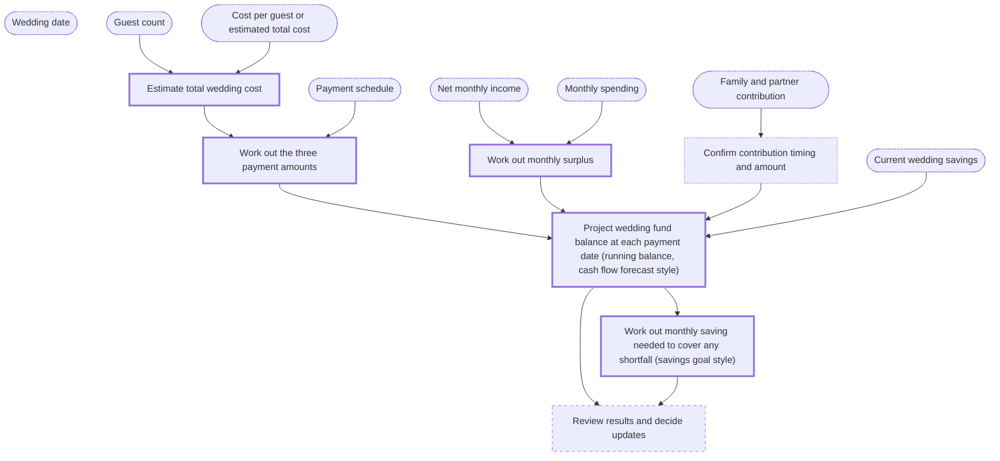

# Domain brief

Confirmed by the person. Written 2026-10-09T16:40:51+00:00. Interview session `8a069e64f6e9402c86b2d861a28ab1a1`.

## Goal

Build and keep up to date a savings plan (sinking fund) that, using a cash flow forecast, shows whether the person can cover each wedding payment on its due date from their own net income, existing savings and the expected family contribution. (ongoing)

## Scope

In scope:

- Saving enough from current monthly net income and the 10k already saved to meet the wedding payments
- Timing of the three payments: fixed 6k due in 21 days, then 50% of the remaining cost 30 days before the wedding, then the other 50% 14 days before
- The 20k contribution from the person's and partner's families, expected about 2 weeks before the wedding
- An uncertain total cost that depends on guest count (about 200 invited; final count known the day before the 30-day payment)
- Re-running the plan as guest numbers, dates and amounts change

Out of scope:

- Deciding whether to hold the wedding money in cash, savings or elsewhere
- Building a full household budget or reorganising spending categories
- How the wedding fits into wider finances (debt, investing, long-term goals, life after the wedding)
- Negotiating or reducing wedding costs
- Tax advice or any recommendation on products

## Glossary

| Standard term | Meaning | You call it | Source |
| --- | --- | --- | --- |
| Sinking fund | Money set aside in regular, usually equal, amounts over time to pay for a specific future cost. In personal finance it is sized by dividing the target amount by the number of periods until it is due (interest ignored unless added). NOT verified against a source: web search was unavailable. | saving to pay for the wedding | not looked up |
| Cash flow forecast | An estimate of money expected to come in and go out over future periods. For each period: opening balance plus expected inflows minus expected outflows gives the closing balance, which is the next period's opening balance. It shows when shortfalls or surpluses may occur. NOT verified against a source: web search was unavailable. | timing the payments; 'projections and estimations' | not looked up |
| Savings goal | A specific amount to be saved by a set date for a particular purpose. The regular saving needed is the amount still to be saved divided by the number of periods until the date, ignoring interest. NOT verified against a source: web search was unavailable. | saving enough for the wedding | not looked up |
| Net income | Income after taxes and deductions. For an individual, take-home pay: the amount that actually reaches the bank account. NOT verified against a source: web search was unavailable. | net pay (10k per month); first said 'gross' and then corrected it | not looked up |
| Gross income | Total income before taxes, deductions or other withholdings. Net income is gross income minus taxes and deductions. NOT verified against a source: web search was unavailable. | initially used 'gross income' for the 10k, then corrected it to net | not looked up |
| Budget | A plan comparing expected income over a period, usually a month, with planned spending and saving. NOT verified against a source: web search was unavailable. | 'current budget'; described as about 5k a month that they 'consume', which seems to mean monthly spending | not looked up |

## What is particular to you

| What is different | How it is handled |
| --- | --- |
| The wedding cost is not fixed: it depends on guest count (about 200 invited now; final count known the day before the 30-day payment). | Plan with an estimated total (ideally a low/high range) until the final count is confirmed, then recalculate the two instalments on the confirmed figure. |
| Payment schedule is a fixed 6k in 21 days, then two equal instalments of 50% each of the remaining cost, at 30 days and 14 days before the wedding. | Treat 'remaining cost' as total cost minus the 6k, and each instalment as half of that. Confirm with the contract that the 6k counts toward the total. |
| A 20k contribution from the person's and partner's families is expected about 2 weeks before the wedding ('I think'; may change). | Enter it as an inflow dated 14 days before the wedding, flagged as uncertain. Do not rely on it to fund the 6k or the 30-day payment, and update the date or amount when confirmed. |
| The person first called their 10k monthly income 'gross' and then corrected it to net. | Use 10k per month net income (take-home pay). Check against payslips or bank deposits. |
| The person says they 'consume' about 5k a month. | Read this as monthly spending (outflows) of about 5k, excluding wedding payments. Confirm that it covers all regular costs and whether it varies. |
| The person has 10k already saved for the wedding. | Use it as the opening balance of the wedding fund in the forecast. |
| The person asked whether to upload bank statements or connect to the bank, or whether variation in spending matters. | Not needed to start: use the 5k average for now. Statements can later be used to check the average and its month-to-month variation. The choice of how to supply data is left open. |
| The person expects to adjust projections as things happen. | The plan is re-run whenever dates, guest count, contribution or spending change, and at least monthly. |

## Inputs

- **Wedding date**: The date from which all payment dates are counted. Not yet stated.
- **Payment schedule**: 6k due in 21 days; 50% of the remaining cost 30 days before; 50% 14 days before. Described in conversation; the contract is the source.
- **Guest count**: About 200 invited; final count known the day before the 30-day payment.
- **Cost per guest or estimated total cost**: Needed to estimate the total from the guest count. Not yet provided.
- **Net monthly income**: About 10k per month take-home pay, stable.
- **Monthly spending**: About 5k per month on average, stated from memory. Bank statements or a bank connection could be supplied later.
- **Current wedding savings**: 10k already saved. Where it is held is out of scope.
- **Family and partner contribution**: 20k in total, expected about 2 weeks before the wedding, not yet firm.

## Process

| Step | Kind | Method | Formula | Needs | Produces | How often |
| --- | --- | --- | --- | --- | --- | --- |
| s1: Estimate total wedding cost | calculation | arithmetic | estimated total cost = guest count x cost per guest (plus any fixed costs, if the person has them) | Guest count, Cost per guest or estimated total cost | Estimated (later confirmed) total wedding cost, as a low, expected and high case | when guest count or prices change |
| s2: Work out the three payment amounts | calculation | arithmetic | payment 1 = 6k; remaining = total cost - 6k; payment 2 = payment 3 = remaining x 50% | s1, Payment schedule | Amount and due date of each of the three payments | when s1 changes |
| s3: Work out monthly surplus | calculation | arithmetic | monthly surplus = net monthly income - monthly spending | Net monthly income, Monthly spending | Amount available to save each month before the wedding | monthly |
| s4: Confirm contribution timing and amount | input |  |  | Family and partner contribution | Confirmed (or still estimated) date and amount of the 20k, an input to s5 | when anything changes |
| s5: Project wedding fund balance at each payment date (running balance, cash flow forecast style) | calculation | arithmetic | closing balance = opening balance + inflows (monthly saving, contribution) - outflows (payments due), repeated per period; opening balance starts at current savings | s2, s3, s4, Current wedding savings | Balance of the wedding fund at each payment date, showing any shortfall or surplus | monthly and whenever inputs change |
| s6: Work out monthly saving needed to cover any shortfall (savings goal style) | calculation | arithmetic | monthly saving needed = shortfall before a payment date / months until that payment date | s5 | Required monthly saving per payment, set against the monthly surplus from s3 | monthly |
| s7: Review results and decide updates | judgment |  |  | s5, s6 | Plain explanation of whether the plan is on track, which assumptions (guest count, contribution date, spending) matter most, and what to update next | monthly and after the guest count is confirmed |

Steps marked `calculation` must run as tested code.

Thick border: calculation (code). Dashed: judgment. Dotted: input from you.

## Definition of done

- [ ] The person can see, for each of the three payments, how much is due, when, and whether the wedding fund covers it on that date.
- [ ] The plan is refreshed at least monthly, and straight away when the guest count is confirmed or the contribution date or amount changes.
- [ ] All calculations run as tested code and give the same answer each time; the person can trace each number back to its inputs.
- [ ] The person feels less stressed about the money because they know in advance of any shortfall.

## Open questions

- What is the wedding date? Without it the payment dates cannot be fixed.
- What is the cost per guest, or the expected total cost? The size of the shortfall depends on it.
- Does the 6k count toward the total cost, so that 'remaining cost' means total minus 6k?
- Is the 5k monthly spending a reliable average, and does it include all regular costs? Bank statements or a bank connection could help; the format is still to be decided.
- How firm is the 20k contribution, and will it really arrive about 2 weeks before the wedding?
- Does the person have other costs apart from the venue payments (for example attire, travel or rings) that should be added to the plan?
- IMPORTANT: every look_up failed because web search was unavailable, so no glossary definition has a source. The definitions are from general knowledge and must be re-checked. Because no source could be found, steps s5 and s6 are written as plain arithmetic (they are a running balance and a simple division) and are only described as 'cash flow forecast style' and 'savings goal style' in their names. Once sources are available, they should be re-labelled with those methods.
- Where to hold the money (cash or savings) and the wider budget are out of scope for now and could be a later piece of work.
