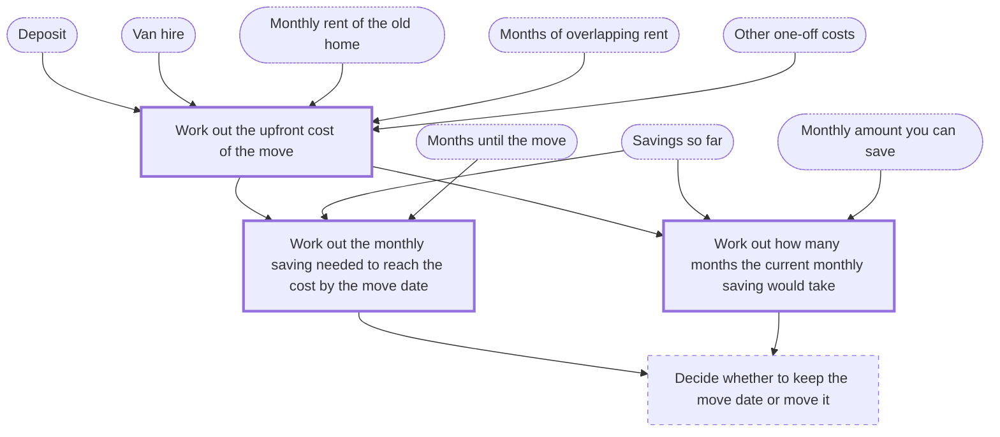

# Domain brief

Confirmed by the person. Written 2026-10-09T22:04:56+00:00. Interview session `5b1f0c7e2a9d4e3f8c6a1d2b3e4f5a60`.

## Goal

Save enough, by the planned move date, to pay the deposit, the van hire and the overlapping rent for a move to another city, and keep the plan up to date as the figures change. (ongoing)

## Scope

In scope:

- The one-off cost of the move: the deposit on the new home, the van hire and a period of months when rent is paid on both homes
- Any other one-off moving costs the person lists, such as cleaning or packing materials
- How much to put aside each month to have that sum by the move date
- How many months the current monthly saving would take, if the move date is not fixed
- Re-running the plan as prices, savings and the move date change

Out of scope:

- Choosing the new home, the city or the van company
- Where to hold the money
- Tax, benefits or any advice on products
- Running costs of the new home after the move

## Glossary

| Standard term | Meaning | You call it | Source |
| --- | --- | --- | --- |
| Sinking fund | Money set aside over a period of time for a known future expense. In personal budgeting it is a category you pay into regularly for a planned cost. | the moving pot | [source](https://en.wikipedia.org/wiki/Sinking_fund) |
| Fixed and variable expenses | Fixed expenses do not change from month to month. Variable expenses can change each month depending on your usage. | rent is the same every month, the van price depends on the days | [source](https://www.chase.com/personal/banking/education/budgeting-saving/fixed-and-variable-expenses) |
| Emergency fund | A cash reserve set aside specifically for unplanned expenses or financial emergencies. | the rainy day money I do not want to touch | [source](https://www.consumerfinance.gov/an-essential-guide-to-building-an-emergency-fund/) |
| Opening balance | The amount in an account at the start of a period. The closing balance of one period is carried forward as the opening balance of the next. | what I have saved so far | [source](https://gocardless.com/guides/posts/what-is-opening-balance/) |

## What is particular to you

| What is different | How it is handled |
| --- | --- |
| For some months the person pays rent on the old home and on the new one at the same time. | Count the overlap as a number of months at the old home's monthly rent. It is a cost of the move, not part of the normal monthly spending. |
| The deposit paid on the old home comes back only after the person has left it. | Do not count that refund as money available before the move. If it arrives later it can be entered as savings then. |
| The van price depends on the number of days and the distance, so it may change. | Enter the best quote as a single amount and update it when a new quote comes in. |
| The person keeps an emergency fund and does not want to use it for the move. | Leave the emergency fund out of the savings so far. Only money put aside for the move counts. |
| The move date may shift by a month or two. | Plan with the months left until the date now, and run the plan again, with the new number of months, when the date changes. |

## Inputs

- **Deposit**: The deposit asked for the new home, paid before the move.
- **Van hire**: The quoted price of the van for the move.
- **Monthly rent of the old home**: What the old home costs each month, which is paid during the overlap.
- **Months of overlapping rent**: How many months rent is paid on both homes.
- **Other one-off costs**: Any other costs of the move that are paid once, each with a name and an amount. May be none.
- **Savings so far**: The money already put aside for the move, not counting the emergency fund.
- **Months until the move**: How many months are left to save before the move.
- **Monthly amount you can save**: What the person can put aside for the move each month.

## Process

| Step | Kind | Method | Formula | Needs | Produces | How often |
| --- | --- | --- | --- | --- | --- | --- |
| m1: Work out the upfront cost of the move | calculation | arithmetic | upfront cost = deposit + van hire + (months of overlapping rent x monthly rent of the old home) + the sum of any other one-off costs | Deposit, Van hire, Monthly rent of the old home, Months of overlapping rent, Other one-off costs | The total sum needed before the move | when a price or the overlap changes |
| m2: Work out the monthly saving needed to reach the cost by the move date | calculation | Sinking fund | monthly saving needed = (upfront cost - savings so far) / months until the move; 0 if the savings already cover the cost | m1, Savings so far, Months until the move | The amount to put aside each month to have the upfront cost by the move date | monthly |
| m3: Work out how many months the current monthly saving would take | calculation | arithmetic | months needed = (upfront cost - savings so far) / monthly amount you can save, rounded up to a whole month; 0 if the savings already cover the cost | m1, Savings so far, Monthly amount you can save | The number of months until the savings would cover the upfront cost | monthly |
| m4: Decide whether to keep the move date or move it | judgment |  |  | m2, m3 | A plain view of whether the move date is realistic at the current saving, and what to change first: the date, the van, the overlap or the saving | monthly |

Steps marked `calculation` must run as tested code.

Thick border: calculation (code). Dashed: judgment. Dotted: input from you.

## Definition of done

- [ ] The person can see the total sum needed before the move and what each part of it is.
- [ ] The person knows how much to put aside each month to have it by the move date, or how many months their current saving would take.
- [ ] The plan is run again whenever a price, the savings or the move date changes.

## Open questions

- How many months will rent be paid on both homes?
- Does the new landlord accept the deposit in parts, or all at once?
- Is there a cheaper van date, for example in the middle of the week?
